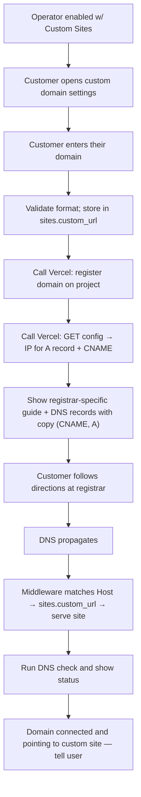

# Custom Domains —  BYOD (Bring Your Own Domain)

## Ship by

ASAP

## What & why

Let customers connect their own domain to their site by adding DNS records at their registrar, with copy-paste values and registrar-specific guides so they never need to understand DNS.

## Problem

Connecting a custom domain today is manual, error-prone, and drives support tickets. Non-technical customers shouldn't need to understand DNS to get a working website and email.

## What we're building

Bring-your-own-domain (BYOD) with self-service DNS. The customer enters their domain, we register it on the Vercel project and pull the required DNS config (A record IP + CNAME) from Vercel, then show the customer exactly which records to add (with registrar-specific guides and one-click copy). We store the domain and route traffic via middleware. No nameserver changes, no OAuth flows.

**Preconditions:**
- Operator has completed the Operator Standard Sites onboarding flow.
- Operator is enabled with Custom Sites and has their own domain to use.

## Design / UX

- Form to enter domain.
- DNS instructions panel with one-click copy for each record value (A record + CNAME).
- "Which registrar are you using?" selector that shows registrar-specific step-by-step guides (e.g. GoDaddy, Namecheap).
- DNS status indicator showing whether records are configured correctly (system checks automatically; customer can return later to see current status).

## User flows

### BYOD: self-service DNS

| Step | Customer does | System does |
|------|----------------|-------------|
| 1 | Opens custom domain / settings in CMS. | Shows form to enter domain. |
| 2 | Enters their domain (e.g. `mysite.com`). | Validates format; saves to `sites.custom_url`. Calls Vercel to register domain on project. Calls Vercel to GET config (IP for A record + CNAME record). |
| 3 | Selects "Which registrar are you using?" (e.g. GoDaddy). | Shows registrar-specific guide + DNS records with copy buttons (CNAME, A). |
| 4 | Logs into their registrar, follows directions we provide. | — |
| 5 | Waits for DNS to propagate (minutes to hours). | Middleware already matches `Host` to `sites.custom_url`; site serves when DNS resolves. |
| 6 | Returns later to check status. | Runs DNS check and shows status. Domain connected and pointing to the custom site — tell user this. |

**Outcome:** Domain connected and pointing to the custom site; customer owns and manages DNS at their registrar.

## Architecture overview

**End state:** `sites.custom_url` contains the customer's domain; A record and CNAME are configured by the customer at their registrar; middleware routes incoming requests to the correct site; Vercel handles SSL.

## Requirements

### Domain entry and storage

**P0**

- UI for customer to enter their domain; persist in `sites.custom_url`.
- Validate domain format before saving.
- Call Vercel API to register the domain on the Vercel project.
- Call Vercel API to GET config (returns IP for A record + CNAME record).

### DNS instructions

**P0**

- Display DNS records to add (A record + CNAME) with one-click copy; values come from Vercel config response.
- Registrar-specific step-by-step guides (e.g. GoDaddy, Namecheap) so customer knows where to add records.
- DNS verification check runs automatically; show status (pending / active) when customer views the domain settings page. When domain is connected, tell the user.

### Routing

**P0**

- Extend middleware to match incoming request's base domain against `sites.custom_url` and serve the correct site data.

### Cross-cutting

**P0**

- We never own the domain; customer always owns it at their registrar.

## How we'll know it worked

- Customers stop filing support tickets about domain setup.
- Domains work on first try using the guides we provide.
- No manual DNS steps required from our team when a customer wants a custom domain.

## Out of scope

- Vercel OAuth flow or customer-facing "Connect Vercel" integration.
- OpenSRS managed DNS / nameserver-based setup.
- Domain purchase UI in our app (customer buys at their registrar or Vercel).
- Domain transfers, renewal management.
- Billing for domains (customer pays their registrar).
- Email DNS configuration (MX, SPF, DKIM, DMARC records).

## Open questions

- Which registrars to support in guides first?

## Tech / constraints

- Existing `sites` table with `custom_url` column; existing middleware to extend for domain routing.
- Vercel API: register domain on project + GET config to retrieve A record IP and CNAME value. Vercel auto-provisions SSL for domains added to projects.
- Preconditions: Operator must have completed Operator Standard Sites onboarding, be enabled with Custom Sites, and have their own domain.

---

## Timeline

| Scope                                 | Est. timeline |
| ------------------------------------- | ------------- |
| BYOD + manual DNS guides + middleware | 2–3 days      |

