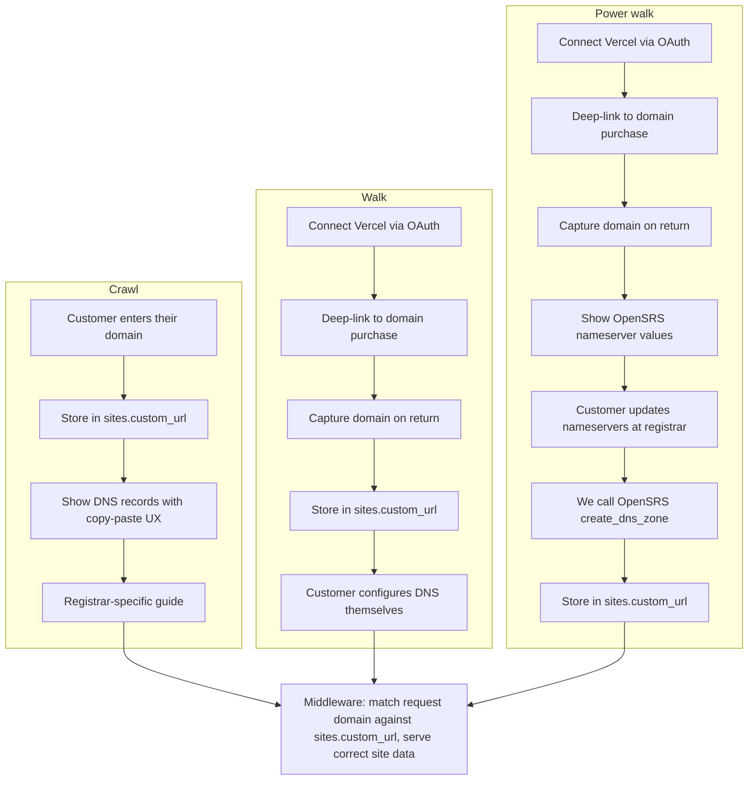

# Custom Domains

## Ship by

ASAP

## What & why

Let customers use their own domain for their site and email marketing with minimal manual DNS work; we never own the domain.

## Problem

Connecting a custom domain today is manual, error-prone, and drives support tickets. Non-technical customers shouldn't need to understand DNS to get a working website and email.

## What we're building

We ship in three phases: **crawl**, **walk**, **power walk**. Each phase adds capability; later phases build on earlier ones.

| Phase | What it is | Scope |
|-------|------------|--------|
| **Crawl** | BYOD | Customer enters their domain, we show DNS records to add (with registrar-specific guides and copy-paste). We store the domain and route traffic via middleware. |
| **Walk** | Vercel OAuth, DNS by customer | Customer connects Vercel, buys a domain (or picks an existing one), we capture and save it; customer configures DNS themselves (we do not show guides). |
| **Power walk** | Vercel OAuth + OpenSRS | Same as Walk (connect, purchase/pick domain), then we manage DNS via OpenSRS: customer points nameservers to OpenSRS, we auto-configure records. |

All paths store the domain in `sites.custom_url` and use middleware to match the request domain to the correct site. Vercel handles SSL.

**Core constraint:** We never own the domain. The customer always owns it (Vercel or any registrar).

## Design / UX

- **Crawl:** Form to enter domain; DNS instructions panel with one-click copy and "Which registrar?" selector for step-by-step guides.
- **Walk:** "Connect Vercel" OAuth flow; deep-link to Vercel domain purchase; return to app to enter or pick domain; no DNS instructions from us.
- **Power walk:** Same as Walk, then show OpenSRS nameserver values and trigger zone creation after customer updates nameservers.

## Architecture overview

**End state for all paths:** `sites.custom_url` contains the customer's domain; DNS records (CNAME, MX, SPF/DKIM/DMARC) are configured per path; middleware routes incoming requests to the correct site; Vercel handles SSL.

## User flows by version

Step-by-step flows so it's clear what the customer does vs what the system does. **Crawl** → **Walk** → **Power walk** (Walk builds on Crawl; Power walk builds on Walk).

### Crawl: BYOD (self-service DNS)

| Step | Customer does | System does |
|------|----------------|-------------|
| 1 | Opens custom domain / settings in our app. | Shows form to enter domain. |
| 2 | Enters their domain (e.g. `mysite.com`). | Validates format; saves to `sites.custom_url`. |
| 3 | Selects "Which registrar are you using?" (e.g. GoDaddy). | Shows registrar-specific guide + DNS records with copy buttons (CNAME, MX, TXT for SPF/DKIM/DMARC). |
| 4 | Logs into their registrar, goes to DNS settings, adds each record using our values. | — |
| 5 | Waits for DNS to propagate (minutes to hours). | Middleware already matches `Host` to `sites.custom_url`; site serves when DNS resolves. |
| 6 | (Optional) Clicks "Verify" or returns later. | (P1) Runs DNS check and shows status. |

**Outcome:** Domain points to the site; customer owns and manages DNS at their registrar.

---

### Walk: Vercel OAuth (connect / purchase; DNS by customer)

| Step | Customer does | System does |
|------|----------------|-------------|
| 1 | Clicks "Connect Vercel" or "Buy a domain with Vercel." | Redirects to Vercel OAuth; customer signs in and authorizes. |
| 2 | Authorizes the app. | Exchanges code for access/refresh token; stores token for this customer/site. |
| 3 | Clicks through to buy a domain (or picks an existing one). We deep-link to Vercel. | Shows link to Vercel domain purchase (or, if API allows, list of their Vercel domains). |
| 4 | On Vercel: searches, buys domain, pays Vercel. Returns to our app. | — |
| 5 | Enters the domain they bought (or picks from list if we have domain-list API). | Saves domain to `sites.custom_url`. |
| 6 | Configures DNS themselves at Vercel (or their provider)—adds CNAME, MX, TXT as they prefer. We do not show Crawl guides. | Middleware matches domain → site when DNS resolves; Vercel handles SSL. |

**Outcome:** Domain is linked to the site; customer bought via Vercel and configured DNS on their own.

---

### Power walk: Vercel OAuth + OpenSRS managed DNS

| Step | Customer does | System does |
|------|----------------|-------------|
| 1 | Clicks "Connect Vercel" or "Buy a domain with Vercel." | Redirects to Vercel OAuth; customer signs in and authorizes. |
| 2 | Authorizes the app. | Exchanges code for access/refresh token; stores token for this customer/site. |
| 3 | Clicks through to buy a domain (or picks an existing one). We deep-link to Vercel. | Shows link to Vercel domain purchase (or, if API allows, list of their Vercel domains). |
| 4 | On Vercel: searches, buys domain, pays Vercel. Returns to our app. | — |
| 5 | Enters the domain they bought (or picks from list if we have domain-list API). | Saves domain to `sites.custom_url`; shows OpenSRS nameserver values with copy. |
| 6 | Logs into their registrar (Vercel or wherever the domain is), finds "Nameservers," replaces with the two we gave. | — |
| 7 | Confirms in our app that they've updated nameservers (or we poll). | Calls OpenSRS `create_dns_zone` with CNAME (website), MX, and TXT (SPF/DKIM/DMARC). |
| 8 | Waits for nameserver propagation (up to 24–48 hrs). Visits their domain. | Idempotent zone creation; middleware resolves domain → site; Vercel provisions SSL. |

**Outcome:** Customer bought/connected via Vercel; we manage DNS for that domain via OpenSRS; they only changed nameservers once.

---

## Crawl: DNS options and rationale

For BYOD we considered several ways to get DNS configured without owning the domain:

| Option | What it is | Why we didn't choose it (or deferred it) |
|--------|------------|------------------------------------------|
| **Nameserver change + we manage DNS (OpenSRS)** | Customer points nameservers to OpenSRS; we call `create_dns_zone` and own all records. | Highest friction: only the domain owner can change nameservers at their registrar, 24–48 hr propagation, and many non-technical users get stuck here. We moved this to **Power walk** as an optional "we manage it for you" path. |
| **Domain Connect** | One-click DNS setup at supported registrars (e.g. GoDaddy) via the Domain Connect protocol. | Not universal; only some registrars support it. We can add later as P1 where available. |
| **Individual records only** | Customer adds CNAME, MX, and TXT records at their current registrar; no nameserver change. | **This is what we chose for Crawl.** |
| **Individual records + registrar-specific guides** | Same as above, plus "Which registrar?" selector and step-by-step guides with copy-paste values. | **This is the Crawl we're building.** |

**Why Crawl is individual records + guides (no nameserver change)**

- **No nameserver change** — Customer keeps their existing DNS provider. One less scary step, no propagation wait for nameserver switches, and works the same whether they're on GoDaddy, Namecheap, Vercel, or elsewhere.
- **Minimal dev and no new APIs** — We only display values and links; no OpenSRS or third-party DNS API in Crawl. Fast to ship.
- **Registrar-specific guides + copy-paste** — Non-technical customers don't have to "find DNS settings"; we tell them exactly where to go and what to paste, which reduces support load and failed setups.
- **Aligns with how others do it** — Same pattern as Shopify, Squarespace, and similar: a small set of records (CNAME for site, MX + TXT for email), no handover of DNS control.

Customers who want to buy via Vercel and have us manage DNS (and are willing to change nameservers once) get that in **Power walk**.

## Requirements

### Crawl: BYOD, self-service DNS

**P0**

- UI for customer to enter their domain; persist in `sites.custom_url`.
- Display DNS records to add: CNAME (website), MX, TXT (SPF, DKIM, DMARC) with one-click copy for each value.
- Registrar-specific step-by-step guides (e.g. GoDaddy, Namecheap) so customer knows where to add records.
- Extend middleware to match incoming request's base domain against `sites.custom_url` and serve the correct site data.

**P1**

- DNS verification check (e.g. CNAME lookup) and status indicator before treating domain as active.

### Walk: Vercel OAuth, DNS by customer

**P0**

- Vercel OAuth flow (Sign in with Vercel): authorize, exchange code for token, store access/refresh token per customer or site.
- Deep-link to Vercel domain purchase so customer can buy a domain on Vercel and return to our app.
- After return: capture domain (free-text entry or pick from list if Vercel domain-list API is available); save to `sites.custom_url`.
- Customer configures DNS themselves at Vercel or their provider; we do not show Crawl DNS guides or record values.
- Token refresh and basic error handling (expired/revoked token).

**P1**

- Domain picker from Vercel account if API permissions allow (currently in private beta).

### Power walk: Vercel OAuth + OpenSRS managed DNS

**P0**

- Vercel OAuth flow (Sign in with Vercel): authorize, exchange code for token, store access/refresh token per customer or site.
- Deep-link to Vercel domain purchase; after return, capture domain (free-text entry or pick from list if Vercel domain-list API is available); save to `sites.custom_url`.
- "Use our DNS" path: show OpenSRS nameserver values; customer updates nameservers at their registrar (Vercel or any other).
- Backend calls OpenSRS `create_dns_zone` with CNAME for website, MX and TXT for email (SPF, DKIM, DMARC).
- Idempotent zone creation and basic error handling (e.g. zone already exists, wrong nameservers).
- Token refresh and basic error handling (expired/revoked token).

**P1**

- Retry or status UX when propagation is delayed or OpenSRS call fails.
- Domain picker from Vercel account if API permissions allow (currently in private beta).

### Cross-cutting

**P0**

- We never own the domain; customer always owns it (Vercel or any registrar).

## How we'll know it worked

- Customers stop filing support tickets about domain setup.
- Domains work on first try for the path they chose (self-service, OpenSRS, or OAuth + self-configured DNS).
- No manual DNS steps required from our team when a customer wants a custom domain.

## Out of scope

- Domain purchase UI in our app (customer buys on Vercel or elsewhere).
- Domain transfers, renewal management, custom nameserver UX beyond "point to OpenSRS."
- Vercel Marketplace Integration (full install flow, Partner API, review process).
- Billing for domains (customer pays Vercel or their registrar).
- Relying on Vercel DNS API for auto-config (permissions in private beta; Power walk uses OpenSRS instead).

## Open questions

- [ ] Should we verify DNS (e.g. CNAME) before activating the custom domain?
- [ ] Exact CNAME target value for website (our platform hostname).
- [ ] Email provider and MX / DKIM record values for email marketing.
- [ ] Which registrars to support in Crawl guides first.
- [ ] OpenSRS nameserver values and IP allowlisting for API access.
- [ ] Ship Walk and Power walk together, or one then the other?

## Tech / constraints

- Existing `sites` table with `custom_url` column; existing middleware to extend for domain routing.
- Vercel auto-provisions SSL for domains added to projects.
- OpenSRS: `create_dns_zone` for Power walk; API requires IP allowlisting.
- Vercel OAuth: Sign in with Vercel (identity scopes only); domain/DNS API permissions in private beta — do not depend on them for Walk or Power walk.

---

## Timeline summary (crawl → walk → power walk)

| Phase | Scope | Est. timeline |
|-------|--------|----------------|
| **Crawl** | BYOD + manual DNS guides + middleware | 2–3 days |
| **Walk** | Vercel OAuth + domain capture; customer does DNS | ~1 day (on top of Crawl) |
| **Power walk** | Add OpenSRS managed DNS + nameserver/zone flow on top of Walk | +2–3 days incremental (on top of Walk) |

Power walk's estimate is the incremental effort to add OpenSRS integration and the extra user flow (show nameservers, customer updates, we create zone); it assumes Walk is already built.
